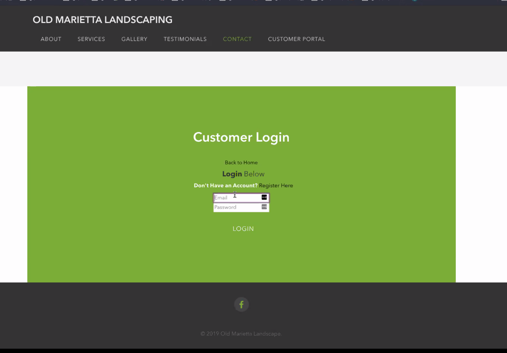
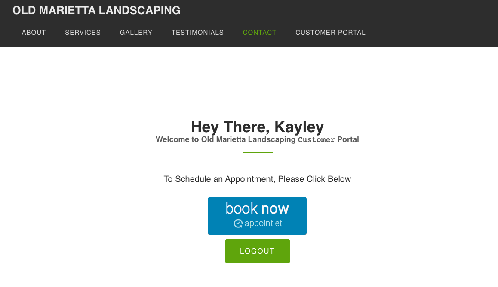

# oldmariettalandscaping

Deployed Website: https://old-marietta-landscaping.herokuapp.com/

Old Marietta Landscaping is a landscaping company in Marietta, Georgia and is owned and operated by Neil Grosse. His wife, Sarah Grosse, decided that creating a fully functional MERN webpage would be an amazing final project for the Georgia Tech Full-Stack Coding and Web Development students Alexandria Edwards, Brendan Goudy, Kayley Bannister, and Sarah Grosse.

This MERN webpage utilizes HTML, CSS, JavaScript, React.js, Express, and MongoDB.

New Technology's Used: PayPal, AppointLet, Visa, MasterCard, American Express, Discover, and Venmo

Nice to Have's: 
- Invoice Generator for Customers in the Customer Portal
- Appointment Setter other than AppointLet

Screenshot of the Customer Login
(Use /login to access this portal)

Screenshots of the Back-End:

Below is a CORS error we received

